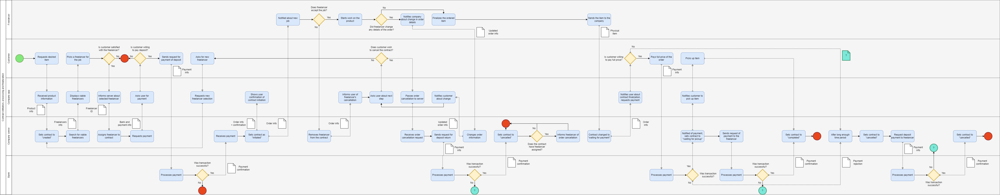

Web Services
===

Task 1:
- design your own business process
- some steps will be later realized as web services
  - one step has to be realized as an external web service, i.e. a service that is not under your control
- use BPMN to model the business process

Design:

# Freelance contracting company

Idea:
- A company responsible for connecting customers who seek product with freelancers and/or other companies who can supply such product
	- e.g., Fiverr, except this company takes the exclusive role of a mediator, any communication and exchange is done via company, never directly

## Entities

1. Customer
   - initiates contracts by requesting a product
   - pays deposit beforehand
   - pays full price after completion, received product
   - responsible for reacting to contract changes

2. Freelancer
   - fullfills initiated contract by providing ordered goods
   - is paid after depositing ordered items and after customer picks them up
   - can initiate changes in order

3. Contract company app
   - serves as interface between customer and company system

4. Contract company server
   - processes requests and provides appropriate responses
   - holds databases of users, their orders and freelancers among other things

5. Bank
   - either fulfills or declines financial transactions initiated by the customer and company server

## Process:

### Processes not mentioned
1. Customer registration/login
2. Freelancer registration/login
3. Freelancer's interface with company is also omitted (I thought about using **Company app** for freelancers too but it created unnecessary cluttering)

### Designed processes
1. Contract initiation - customer requests product, selects freelancer and makes a deposit
2. Contract processing - freelancer creates the product, potentially changing order details, in which case customer needs to react
3. Contract finalization - freelancer drops off finished product at the company and customer is expected to finalize the deal by picking it up and finishing payment

The idea of a flow is as follows:
1. **customer** requests desired item
2. **company app** sends customer's order information to server
3. **company server** searches freelancer database for a good match
4. if none is found
	1. interaction ENDS
5. **customer** gets to choose from available freelancers
6. once **customer** chooses a freelancer, deposit is requested
	1. if deposit is not paid
		1. interaction ENDS
7. **company server** initiates the contract
8. **freelancer** is informed about the new job
	1. if they refuse
		1. customer is informed
		2. if **customer** wishes to end the order
			1. deposit is returned
			2. interaction ENDS
		3. GOTO 2.
9. if **freelancer** alters order info 
	1. **customer** is informed
	2. if **customer** doesn't accept the changes
		1. GOTO 2.
10. **freelancer** processes and finalizes the product
11. **freelancer** deposits the product at the company
12. **company** sets the contract as waiting for customer and informs customer
13. if **customer** refuses to pick up the item
	1.  contract is closed
	2.  **freelancer** received part of deposit and deposited item
	3.  interaction ENDS
14. **customer** pays the remaining price of order
15. **customer** picks up the item
16. **company** sends part of the payment to freelancer
17. **contract** is finished
18. interaction ENDS

## BPMN Design

Made in draw.io

Notes and issues:
- some parts were unclear to me as how to solve then, these are signified by green elements with question marks
	- specifically payment from company to either customer or freelancer should always go through, as these payments are made by money that was before deposited by customer and only after the company has received the payment
		- I however doubt we can simply ignore that part as "never happens"
	- In cases where message is a physical item (e.g., custmer picks up the order), is that a valid message?