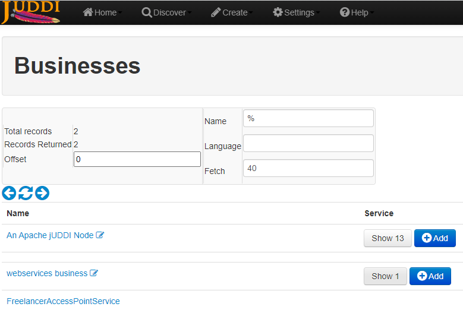

06 - jUDDI self-deploying server
===

The server was integrated into modified version of existing `uddi-annotations` example.

A business `uddi:www.blackie.contractor.com:webservices` with credentials `admin:admin` was created to shelter the automatically subscribed server.

When server starts, its service appears in jUDDI's GUI:

with its details properly set

and disappears from the list once server is terminated

## Notes to re-create project

- once Tomcat server is created in Eclipse, `server.xml` needs to have ports re-set (8080+8043 used by juddi, 9080 in my case used by Nahimic SW, 10080 is a socket reerved by Amanda whatever that is so Chrome will refuse to work with that, so 11080+11043 seems to work fine)

- follow other bits of info from the slides (custom DTD access flag for server, derby JARs...)

- hardcoded port for WSDL in FreelancerAccessPoint. This is due to the fact that changing `${serverPort}` in XML seems to break the tomcat configuration somehow.